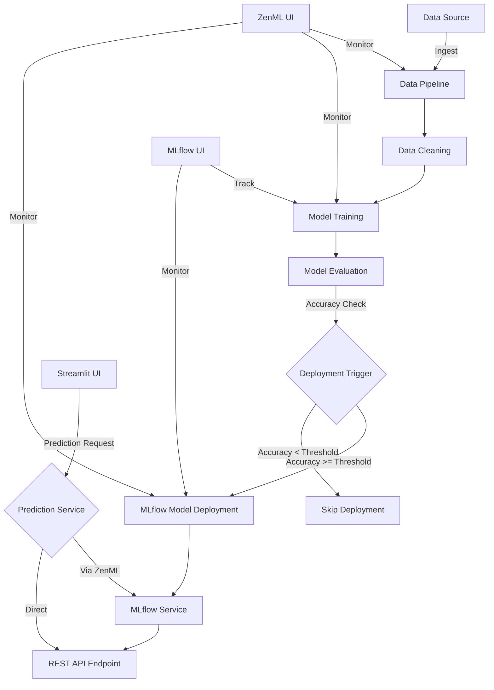

```mermaid
graph TD
    A[Data Source] -->|Ingest| B[Data Pipeline]
    B --> C[Data Cleaning]
    C --> D[Model Training]
    D --> E[Model Evaluation]
    E -->|Accuracy Check| F{Deployment Trigger}
    F -->|Accuracy >= Threshold| G[MLflow Model Deployment]
    F -->|Accuracy < Threshold| H[Skip Deployment]
    G --> I[MLflow Service]
    I --> J[REST API Endpoint]
    
    K[Streamlit UI] -->|Prediction Request| L{Prediction Service}
    L -->|Via ZenML| I
    L -->|Direct| J

    M[ZenML UI] -->|Monitor| B
    M -->|Monitor| D
    M -->|Monitor| G

    N[MLflow UI] -->|Track| D
    N -->|Monitor| G
```
